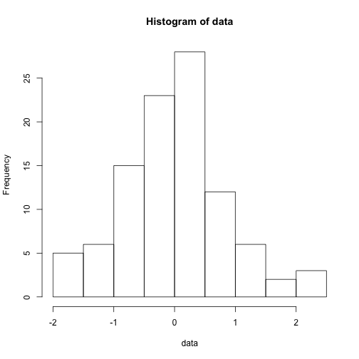
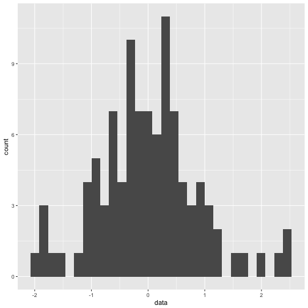

R语言第零课
========================================================
author: 夏骁凯
date: 2016年11月25日
autosize: true

R语言简介
========================================================

“R语言是披着编程语言外衣的统计软件”

——某统计学家

什么是R
==========
- 数据处理与绘图语言
- 数据处理生态环境

为什么要用R
=========
- 学术界主流
- 体积小巧，便于部署
- 生态系统完善
    - 便捷使用不同的统计算法
    - 直接使用前沿的统计算法
- 可以编程使用
    - 自动完成研究工作
- 建立可重复报告（Rmarkdown + Docker + Packrat）
- 免费开源

我们（心理学学生）为什么要学R
=========
**心理学生最适合入门的编程语言**

- 语法简单，语法特性较少
- 与其他高级语言（M，Python）语法类似
- 可以直接用来处理数据，练习机会较多
- 有大量的Package，直接使用各种新的统计方法
- 优秀的统计学教具
    - 逐条编写语句实现数据处理
    - 直接应用最新的统计方法
- 便于完成毕业论文

R语言课程简介
=======
**两个阶段**
  - 零基础课程
  - 高级应用课程

零基础课
=========
**授课内容**
- 基本数据结构
- 常用程序语法
- 常用Package介绍
- 帮助系统的使用

**授课目标**
- 掌握R语言的基本使用方法
- 培养对于R语言的自学能力

高级应用课程
======
**授课内容**
- 常用统计方法
- 绘图
- 高级统计方法简介

**授课目标**
- 了解较新的统计方法
- 了解R语言可以完成的其他事情

自我介绍环节
=========


初识R语言
===========
两个主要资源
- CRAN
- Rstudo

CRAN
===============


获取R语言资源
**CRAN** —— The Comprehensive R Archive Network

https://cran.r-project.org

Rstudio
=================


安装IDE —— Integrated Development Environment

https://www.rstudio.com

第一个程序——Hello World
==========

```r
"Hello World!"
```

```
[1] "Hello World!"
```

- 交互式编程
- 基本数据类型

第二个程序
=========

```r
data <- rnorm(100, mean = 0, sd = 1)
hist(data)
```



- 语句易于理解
- 绘图便捷

第三个程序
=======

```r
# install.packages("ggplot2")
library(ggplot2)
data <- as.data.frame(data)
ggplot(data, aes(x = data)) + geom_histogram()
```




最后见识下酷炫的应用
=========

install.packages("devtools")

devtools::install_github('lchiffon/REmap')

library(REmap)

remap(demoC)


