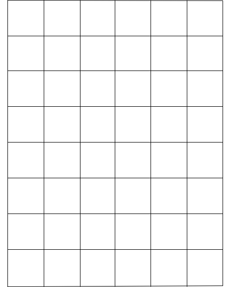

第二课：高级数据结构
========================================================
author: 夏骁凯
date: 2016年11月28日
autosize: true

本节课程知识点
========================================================
- 函数
- 数据框、矩阵
- 因子
- 列表

函数
=====================
简单的认识一下：

c( )

hist( )

rnorm( )

1. 函数
=========
定义：在编程环境中完成某项动作的命令，**封装**了一系列复杂的代码

格式：**函数名（形式参数 = 真实参数）**

参数调用
==========
- 根据相对位置调用
- 使用形式参数调用

帮助系统
=========
**当我不知道的时候，我就打个问号**

2. 长方形的数据结构：矩阵、数据框
===========


特征：各行、各列长度一致

矩阵与数据框的差异
===========
**数据框：**

- 统计概念
- 横为行（row）或观测（observation），纵为列（column）或属性（attribution）
- 可以为属性命名

**矩阵：**

- 数学概念，元素只可为数字

举例
===========

```r
head(iris) #iris为鸢尾花数据，记录了不同品种的鸢尾花的各位置的长度
```

```
  Sepal.Length Sepal.Width Petal.Length Petal.Width Species
1          5.1         3.5          1.4         0.2  setosa
2          4.9         3.0          1.4         0.2  setosa
3          4.7         3.2          1.3         0.2  setosa
4          4.6         3.1          1.5         0.2  setosa
5          5.0         3.6          1.4         0.2  setosa
6          5.4         3.9          1.7         0.4  setosa
```

数据框的建立
============

```r
num <- 1:5
char <- letters[1:5] #letters是R中内建的向量，内容为小写字母
mydataframe <- data.frame(number = num, letter = char) #建立数据框，参数中等号前为列名，等号后为索引的向量
mydataframe
```

```
  number letter
1      1      a
2      2      b
3      3      c
4      4      d
5      5      e
```

数据框的属性
==========

```r
nrow(mydataframe) #查看行数
```

```
[1] 5
```

```r
ncol(mydataframe) #查看列数
```

```
[1] 2
```

```r
names(mydataframe) #查看列名
```

```
[1] "number" "letter"
```

```r
colnames(mydataframe) #查看列名
```

```
[1] "number" "letter"
```

数据框的索引（1）
==========

```r
mydataframe[,1] #提取第一列
```

```
[1] 1 2 3 4 5
```

```r
mydataframe[2,] #提取第二行
```

```
  number letter
2      2      b
```

```r
mydataframe[3,2] #提取第三行第五列
```

```
[1] c
Levels: a b c d e
```
在对数据框使用方括号提取时，逗号前表示行数，逗号后表示列数，空出不写则代表相应的整行/整列

数据框的索引（2）
=======

```r
mydataframe$number #使用$符号可以直接根据列名提取数据
```

```
[1] 1 2 3 4 5
```

数据框的操作（1）
============

```r
rbind(mydataframe,mydataframe) #行合并
```

```
   number letter
1       1      a
2       2      b
3       3      c
4       4      d
5       5      e
6       1      a
7       2      b
8       3      c
9       4      d
10      5      e
```

```r
cbind(mydataframe,mydataframe) #列合并
```

```
  number letter number letter
1      1      a      1      a
2      2      b      2      b
3      3      c      3      c
4      4      d      4      d
5      5      e      5      e
```

数据框的操作（2）
=========
- 删除、修改与向量一致
- 可以使用merge()融合
- 可以使用na.omit()删除缺失值

数据框的向量化计算
==========

```r
x <- cbind(x1 = 3, x2 = c(4:1, 2:5))
head(x) #head()函数可以简单查看数据框的前六行
```

```
     x1 x2
[1,]  3  4
[2,]  3  3
[3,]  3  2
[4,]  3  1
[5,]  3  2
[6,]  3  3
```

```r
apply(x, 2, sum) #计算每行总和
```

```
x1 x2 
24 24 
```

```r
apply(x, 1, sum) #计算每列总和
```

```
[1] 7 6 5 4 5 6 7 8
```

矩阵的建立
===========

```r
matrix(1:20, nrow = 5, ncol = 4)
```

```
     [,1] [,2] [,3] [,4]
[1,]    1    6   11   16
[2,]    2    7   12   17
[3,]    3    8   13   18
[4,]    4    9   14   19
[5,]    5   10   15   20
```

```r
matrix(1:20, nrow = 4, ncol = 5, byrow = T) #byrow参数决定了矩阵的填充方式
```

```
     [,1] [,2] [,3] [,4] [,5]
[1,]    1    2    3    4    5
[2,]    6    7    8    9   10
[3,]   11   12   13   14   15
[4,]   16   17   18   19   20
```

矩阵的属性与操作
===========
与数据框相同

3. 离散数据的数据结构：因子
===========
称名数据、分类数据，应当使用因子进行存储

因子的建立
==========

```r
factor(letters[rep(1:3,3)]) #建立称名变量
```

```
[1] a b c a b c a b c
Levels: a b c
```

```r
factor(letters[rep(1:3,3)], ordered = TRUE) #建立顺序变量
```

```
[1] a b c a b c a b c
Levels: a < b < c
```

因子的属性
======

```r
myfactor <- factor(letters[rep(1:3,3)])
length(myfactor) #查看因子的长度
```

```
[1] 9
```

```r
levels(myfactor) #查看因子的水平
```

```
[1] "a" "b" "c"
```

因子的索引、操作
=======
与向量相同

当因子遇上数据框：分组汇总
=========
- 主要函数：aggregate()；by()
- 基本形式：function(data, by = factor, FUN)

分组汇总示例
==========

```r
head(mtcars)
```

```
                   mpg cyl disp  hp drat    wt  qsec vs am gear carb
Mazda RX4         21.0   6  160 110 3.90 2.620 16.46  0  1    4    4
Mazda RX4 Wag     21.0   6  160 110 3.90 2.875 17.02  0  1    4    4
Datsun 710        22.8   4  108  93 3.85 2.320 18.61  1  1    4    1
Hornet 4 Drive    21.4   6  258 110 3.08 3.215 19.44  1  0    3    1
Hornet Sportabout 18.7   8  360 175 3.15 3.440 17.02  0  0    3    2
Valiant           18.1   6  225 105 2.76 3.460 20.22  1  0    3    1
```

aggregate函数
==========

```r
aggregate(mtcars, list(mtcars$cyl), mean)
```

```
  Group.1      mpg cyl     disp        hp     drat       wt     qsec
1       4 26.66364   4 105.1364  82.63636 4.070909 2.285727 19.13727
2       6 19.74286   6 183.3143 122.28571 3.585714 3.117143 17.97714
3       8 15.10000   8 353.1000 209.21429 3.229286 3.999214 16.77214
         vs        am     gear     carb
1 0.9090909 0.7272727 4.090909 1.545455
2 0.5714286 0.4285714 3.857143 3.428571
3 0.0000000 0.1428571 3.285714 3.500000
```

by函数
==========

```r
by(mtcars, mtcars$cyl, sum)
```

```
mtcars$cyl: 4
[1] 2763.233
-------------------------------------------------------- 
mtcars$cyl: 6
[1] 2550.16
-------------------------------------------------------- 
mtcars$cyl: 8
[1] 8628.809
```

两个函数有什么差别？
===========
将aggregate和by中的FUN参数换成head试试？

4. 列表是个筐，什么都能装：列表
=========

```r
mylist <- list(letters = letters, mydataframe = mydataframe, myfactor = myfactor) # 列表的建立
mylist
```

```
$letters
 [1] "a" "b" "c" "d" "e" "f" "g" "h" "i" "j" "k" "l" "m" "n" "o" "p" "q"
[18] "r" "s" "t" "u" "v" "w" "x" "y" "z"

$mydataframe
  number letter
1      1      a
2      2      b
3      3      c
4      4      d
5      5      e

$myfactor
[1] a b c a b c a b c
Levels: a b c
```

列表的索引
========

```r
mylist$letters
```

```
 [1] "a" "b" "c" "d" "e" "f" "g" "h" "i" "j" "k" "l" "m" "n" "o" "p" "q"
[18] "r" "s" "t" "u" "v" "w" "x" "y" "z"
```

```r
mylist[[2]]
```

```
  number letter
1      1      a
2      2      b
3      3      c
4      4      d
5      5      e
```

5. 几个常用的小函数
============

```r
str(mylist) #查看数据的结构
```

```
List of 3
 $ letters    : chr [1:26] "a" "b" "c" "d" ...
 $ mydataframe:'data.frame':	5 obs. of  2 variables:
  ..$ number: int [1:5] 1 2 3 4 5
  ..$ letter: Factor w/ 5 levels "a","b","c","d",..: 1 2 3 4 5
 $ myfactor   : Factor w/ 3 levels "a","b","c": 1 2 3 1 2 3 1 2 3
```

```r
class(mydataframe) #查看数据的类型
```

```
[1] "data.frame"
```

```r
head(mydataframe) #查看数据的前六行
```

```
  number letter
1      1      a
2      2      b
3      3      c
4      4      d
5      5      e
```

几个常用的小函数
==========

```r
as.character(myfactor) #as.*函数可以转换数据类型与数据结构
```

```
[1] "a" "b" "c" "a" "b" "c" "a" "b" "c"
```

```r
is.character(myfactor) #is.*函数可以对数据类型与数据结构进行逻辑判断
```

```
[1] FALSE
```

